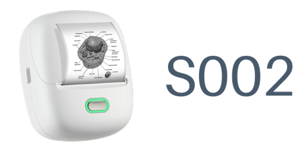

# ORGSTA S002 — imprimante thermique dans Home Assistant

<p align="center">
  
</p>

Intégration custom Home Assistant pour les imprimantes thermiques **ORGSTA S002**
(protocole propriétaire **YK/CUS**, et non ESC/POS). Elle permet d'imprimer du texte et
des images depuis HA — automatisations, scripts, dashboard — **via la pile Bluetooth de
Home Assistant**, donc **à travers un proxy BLE ESP32** (`bluetooth_proxy: active: true`)
ou un adaptateur local, sans code spécifique.

## Comment ça marche

**L'imprimante ne parle pas ESC/POS.** Les commandes classiques n'ont aucun effet sur cette S002 :
son protocole (**YK/CUS**) a été décodé depuis `libykDataPacket.so` de l'application Android. Une
trame, c'est :

```
0x64 | type | compteur (mod 64) | longueur LE16 | données | contrôle 32 bits | 0x9b
```

L'imprimante est binaire : **576 points de large, 72 octets par ligne, 1 = noir, bit de poids fort
en premier**.

### Le déroulé d'une impression

1. un **verrou par imprimante** — deux impressions simultanées s'entrelaceraient ;
2. ouverture du transport, puis la séquence obligatoire : **token** (compteur 1) → **largeur**
   (compteur 2, l'imprimante en déduit 72 o/ligne) → **tranches d'image** → avance finale ;
3. chaque tranche embarque 8 lignes, et sa taille est **recalculée après chaque trame** à partir du
   pic de latence récent. C'est la correction d'un vrai bug : la latence du chemin Bluetooth varie
   du simple au triple, une trame de taille fixe finissait par dépasser la tolérance de pause de
   l'imprimante (~400 ms), qui **refermait la tâche et avalait 4 mm de blanc** ;
4. déconnexion, puis compte rendu (trames, octets, durée, latences).

### Le contrôle de flux par crédits

C'est le cœur du sujet. L'imprimante n'accepte qu'un petit nombre de paquets, puis en redonne :
elle envoie une notification qui vaut « N paquets autorisés ». Le transport compte les crédits,
décrémente à chaque écriture et **attend** quand il n'en a plus. Sans cette comptabilité, le raster
partait plus vite que sa mémoire ne le consommait — c'est ce qui faisait **manger des lignes**.

### Les deux transports, interchangeables

| | `proxy` (Bluetooth) | `node` (réseau) |
| --- | --- | --- |
| Chemin | pile Bluetooth de Home Assistant, via un proxy ESP32 | ESP32-C3 près de l'imprimante, serveur TCP |
| Coût d'une écriture | ~54 à 116 ms selon le proxy | **~13 ms** |
| Page de 93 mm | ~9 s | **~2 s** |

Détail qui a compté côté Bluetooth : le sélecteur intégré de Home Assistant retient le scanner dont
l'annonce est la **plus récente**, pas la plus forte. Sur ce parc, il passait par un proxy à
**−99 dBm** au lieu d'un autre à **−84**, ce qui doublait le coût par paquet et provoquait les
blancs. L'intégration va donc chercher tous les scanners et **trie sur le RSSI**.

Côté réseau, le nœud est volontairement *bête* : il ne connaît ni le protocole YK ni la
rasterisation, il écrit les octets qu'on lui donne et gère les crédits. C'est ce qui rend les deux
transports interchangeables — et ce qui a permis de décoder le protocole sur un PC avant même
d'avoir une imprimante à portée.

### Repères

300 dpi (11,81 points/mm), 48,8 mm imprimables sur du papier de 57 mm, 20 mm/s. La recette de test
(93 mm) passe en 79 443 octets et 31 trames.

## Images de marque

L'icône et le logo de l'intégration sont **embarqués dans le dépôt**, dans
`custom_components/s002_printer/brand/` — depuis Home Assistant 2026.3 une intégration
personnalisée peut fournir ses propres images, sans passer par le dépôt `home-assistant/brands`.

| Fichier | Dimensions | Usage |
| --- | --- | --- |
| `icon.png` | 256×256 | icône de l'intégration (page *Intégrations*, appareils) |
| `icon@2x.png` | 512×512 | version hDPI |
| `logo.png` | 512×256 | logo paysage (en-tête) |
| `logo@2x.png` | 1024×512 | version hDPI |

Elles se régénèrent à l'identique :

```bash
python3 tools/make_brand.py      # nécessite Pillow
```

La source est le visuel de l'appareil, versionné dans `tools/brand-source/s002-printer.jpg` :
le fond est retiré automatiquement (le fond du visuel est du blanc pur alors que la carrosserie
descend plus bas, donc un remplissage par diffusion le détoure sans entamer la coque), puis la
garde la **plus grande région connexe** élimine le second objet présent sur le visuel et les
poussières de compression. Le mot-symbole est mesuré pour ne jamais être tronqué.

## Pourquoi une intégration dédiée ?

L'ORGSTA S002 ne parle **pas ESC/POS** : son protocole a été décodé depuis
`libykDataPacket.so` de l'application Android *Snap and Tag*. Les commandes ESC/POS
classiques n'ont aucun effet sur cette imprimante.

Les caractéristiques mesurées sur le matériel, encodées dans cette intégration :

- tête **576 points** (72 octets par ligne), 300 dpi, largeur imprimable ≈ 48,8 mm ;
- image envoyée **non compressée** (le mode zlib est refusé par ce modèle) ;
- **40 lignes maximum par trame** (2 880 o) : au-delà, la trame est rejetée silencieusement ;
- une **pause de ~1 s entre deux trames referme la tâche** et l'imprimante avance 4 mm de
  blanc → les tranches sont envoyées **dos à dos** (tolérance mesurée : 400 ms) ;
- le service BLE `ff00` existe en **deux exemplaires** ; le canal d'écriture utile est la
  seconde occurrence (handle le plus haut).

## Installation (HACS)

1. HACS → *Intégrations* → menu ⋮ → **Dépôts personnalisés**
   URL : `https://github.com/rpouetpouet/s002-thermal-printer` — catégorie *Intégration*.
2. Télécharger, puis **redémarrer Home Assistant**.
3. *Paramètres → Appareils et services → Ajouter une intégration → ORGSTA S002*.
   Saisir l'adresse MAC de l'imprimante (elle s'affiche dans l'appli mobile ou sur
   l'étiquette ; l'imprimante est aussi proposée automatiquement si HA la découvre).

Aucun appairage n'est nécessaire : l'imprimante accepte les connexions BLE sans
association.

## Services

| Service | Effet |
| --- | --- |
| `s002_printer.print_test` | Motif de validation (repères + 6 bandes), ≈ 14 mm de papier |
| `s002_printer.print_text` | Imprime les lignes fournies (`text`, `scale` 1-6, **défaut 3**) |
| `s002_printer.feed` | Avance papier seule (`mm`) |
| `s002_printer.print_raw` | Raster brut en base64 (72 o/ligne, 1 = noir) — reproductible à l'octet |
| `s002_printer.print_image` | Image PNG/JPEG en base64, mise à l'échelle 576 points (`enhance`, `dither`, `invert`) |
| `s002_printer.diagnose` | Se connecte **sans imprimer** et renvoie le débit mesuré |

Tous les services acceptent `address` (si plusieurs imprimantes) et renvoient un compte
rendu avec **les mesures de débit** (`frames`, `avg_frame_ms`, `throughput_kbps`,
`channel_handle`) : c'est ce qui permet de juger si la liaison tient la charge.

### Rendu des photos

Par défaut, `print_image` **prépare** la photo avant de la réduire à 576 points : étalement des niveaux
(`autocontrast`) puis accentuation des contours (`UnsharpMask`), et enfin tramage Floyd-Steinberg.
C'est le rendu retenu après comparaison sur papier : une photo au ciel clair avec un sujet blanc donne,
sans étalement des niveaux, la même bouillie de points partout — perçu à tort comme un manque de
résolution. `enhance: false` imprime l'image telle quelle, `dither: false` force le seuil franc.

L'option `gamma` corrige la **densité** (défaut `0.85`). Elle existe parce que le papier thermique a du
**gain de point** : chaque point imprimé ressort plus gros que sa taille nominale, donc une zone tramée
paraît plus sombre que sa valeur en données. Mesuré sur une photo au ciel clair, en pourcentage de
points noirs : **29,6 %** sans correction, **27,0 %** à `gamma=0.85`, 25,0 % à 0,75, 22,8 % à 0,65.
Le réglage `0.85` est celui retenu après comparaison des quatre sur papier. En dessous de 1 la photo
s'éclaircit, au-dessus elle s'assombrit.

Une image **déjà en noir et blanc franc** (QR code, tracé, texte scanné) n'est **jamais** tramée, même
si le tramage est demandé : le tramage y détruirait la lisibilité. La détection est automatique.

**Imprimer une photo en plus grand** : la tête ne fait que 576 points de large (48,8 mm), on ne peut
donc pas élargir. En revanche, en imprimant le raster **tourné d'un quart de tour**, la hauteur de la
photo occupe la largeur du papier et sa largeur s'étale sur la longueur du rouleau : une photo
1280×720 passe de 48,8 × 27,4 mm à **48,8 × 87,1 mm**, avec **1,8 fois plus de points par pixel
source**. Il suffit de faire pivoter la bande pour la lire.

### Exemple d'automatisation

```yaml
action:
  - service: s002_printer.print_text
    data:
      text: |
        Portail ouvert
        28/09 18:42
      scale: 3
    response_variable: cr
  - service: system_log.write
    data:
      message: "Imprimé en {{ cr.duration_s }} s ({{ cr.timings.avg_frame_ms }} ms/trame)"
```

## Batterie et mode de liaison (transport « node » uniquement)

L'imprimante n'accepte **qu'un client à la fois**. Le nœud la gardait donc en permanence, et aucun
téléphone ne pouvait s'y connecter. Depuis le firmware v2, le nœud **la rend après un délai
d'inactivité** (120 s par défaut) et **la reprend tout seul** à la prochaine impression (1 à 3 s,
invisible côté Home Assistant).

Avec le transport « node », l'entrée expose trois entités :

- **`sensor.*_batterie`** — le pourcentage annoncé par l'imprimante dans sa trame d'état
  (18 octets, poussée toutes les 5 s). Le nœud la **rejetait** auparavant : c'est pour cela que la
  batterie restait inconnue en mode nœud alors que le chemin proxy la lisait très bien. Le capteur
  affiche « inconnu » tant qu'aucune trame n'est arrivée (le nœud renvoie `batterie=-1`) — jamais
  « 0 % », qui ferait croire à une batterie vide ;
- **`switch.*_maintenir_la_liaison`** — **allumé = mode manuel** : le nœud garde la liaison et
  ignore le délai (utile avant une série d'impressions, ou pour empêcher l'app du téléphone de
  prendre la main) ; **éteint = mode auto** : il la rend après le délai, ce qui laisse un téléphone
  se connecter ;
- **`button.*_liberer_le_bluetooth`** — rend l'imprimante **tout de suite**, sans attendre le délai.
  Le nœud repasse alors en mode auto, et l'interrupteur ci-dessus se remet sur « éteint » de
  lui-même : son état est **relu sur le nœud**, jamais mémorisé côté Home Assistant.

Avec le transport « proxy », ces entités **n'existent pas**, volontairement : le chemin BLE de Home
Assistant ne voit la trame d'état que pendant une impression, et il n'y a aucune liaison à libérer
(il ferme déjà la connexion après chaque impression). Des entités vides en permanence auraient été
plus trompeuses que leur absence.

## Réglages de transport (Options)

| Option | Défaut | Rôle |
| --- | --- | --- |
| `chunk_size` | 200 | Taille des paquets d'écriture BLE (20-237 ; MTU 240) |
| `lines_per_frame` | **8** | Lignes par trame. 8 ≈ 160 ms via proxy ; 40 (le maximum protocolaire) ≈ 870 ms → **blancs de 4 mm garantis** |
| `frame_pause_ms` | 0 | Pause entre trames (≤ 400 ms, sinon blanc garanti) |
| `feed_before_mm` / `feed_after_mm` | 0 / **15** | Marges d'avance autour de l'image. Les 15 mm après impression laissent de quoi couper ou déchirer la bande sans entamer le contenu ; mettre 0 pour désactiver. |

### Choisir le transport : `proxy` (BLE) ou `node` (réseau)

Deux transports interchangeables, réglés par les **options** de l'intégration (bouton
*Configurer* sur la fiche de l'appareil) :

| Option | Défaut | Rôle |
| --- | --- | --- |
| `transport` | `proxy` | `proxy` = via un proxy Bluetooth ESP32 de Home Assistant ; `node` = via un nœud d'impression dédié, sur le réseau |
| `node_host` | *(vide)* | Adresse du nœud — **l'IP ou le nom d'hôte seul**, sans libellé (voir le piège) |
| `node_port` | `3333` | Port TCP du nœud |

Pourquoi le nœud : un ESP32-C3 posé près de l'imprimante écrit en BLE directement
(≈ 13 ms par écriture, contre 54 à 116 ms via un proxy) et expose ces écritures sur un
serveur TCP. Une page de 93 mm part en ≈ 2 s, et une ligne de texte depuis Home Assistant
en ≈ 1 s. Le nœud reste volontairement *bête* : il ne connaît ni le protocole YK ni la
rasterisation, il écrit les octets qu'on lui donne et gère le contrôle de flux par crédits.

⚠️ **Piège de saisie** : ne pas recopier une ligne de configuration YAML dans le champ.
`node_host: 192.168.42.62` (libellé compris) devient un nom d'hôte invalide →
`Name does not resolve`, message qui ne désigne pas la cause. La valeur attendue est
`192.168.42.62`. Depuis la v0.2.1 le libellé, les guillemets et un `:port` collé sont
retirés automatiquement, et un avertissement est journalisé — mais autant saisir la bonne valeur.

**Vérifier le transport réellement utilisé** : les deux chemins réussissent une impression,
donc un succès ne dit pas par où la page est passée. Le nœud expose un compteur de son côté :

```bash
python3 tools/s002_node_client.py 192.168.42.62 statut     # relever « ecritures »
# faire l'impression, puis relever à nouveau : le compteur doit avoir augmenté.
```

Compteur figé = la page est passée par le proxy, pas par le nœud.

`diagnose` suit le transport configuré et, en cas d'échec, **renvoie** un rapport
(`ok: false`, `erreur`, transport visé) au lieu de lever une exception.

## Robustesse du transport (v0.1.8)

Deux protections, nées de mesures sur le matériel — sans elles, une impression **réussie**
peut être suivie d'une impression **striée** sans qu'on ait rien changé au code :

- **Taille de trame adaptative.** L'intégration vise **250 ms par trame** et recalcule la taille
  après chaque trame à partir du **pic de latence récent** (de 2 lignes au minimum jusqu'à
  `lines_per_frame`). La latence d'un proxy BLE varie du simple au triple ; une trame fixe finit
  par dépasser la tolérance de pause (~400 ms), l'imprimante referme la tâche et avance 4 mm de blanc.
- **Choix du proxy au meilleur RSSI.** Home Assistant retient par défaut le scanner dont l'annonce
  est la plus **récente**, pas la plus **forte** : mesuré sur ce parc, la connexion est passée par un
  proxy à **−99 dBm** au lieu d'un autre à **−84 dBm**, doublant le coût par paquet (97 ms contre 54).
  L'intégration liste les scanners via `async_scanner_devices_by_address` et **trie sur le RSSI**.
  Le chemin retenu et la liste des candidats sont renvoyés par les services (`timings.scanner_source`,
  `scanner_rssi`, `scanner_candidats`).

## Résultats mesurés (chemin proxy BLE ESP32-C3 → S002)

Test de référence : image « MARVIN » encadrée, 200 lignes (16,93 mm), imprimée **continue**
depuis Home Assistant, alors que la VM HA n'a **aucun adaptateur Bluetooth**.

| grandeur | valeur |
| --- | --- |
| connexion | 460 ms (une fois l'appareil connu) ; 14-23 s au tout premier essai (découverte) |
| coût par paquet de 200 o | **54 ms** en moyenne, 118 ms max (≈ 4 ms en direct sur un hôte BLE local) |
| débit utile | **2,6 ko/s** |
| trame de 8 lignes | **155 ms** moyenne, 218 ms max → sous la tolérance de pause (400 ms) |
| impression complète | 6,4 s pour 16,93 mm (200 lignes, 25 tranches) |

## Limites connues

- **Débit via proxy BLE** : chaque écriture coûte un aller-retour Wi-Fi. Sur un ESP32-C3
  (mono-cœur, radio partagée BLE/Wi-Fi), utiliser `chunk_size` élevé et vérifier
  `avg_frame_ms` avec `s002_printer.diagnose`. Si le débit est insuffisant, une passerelle
  locale (Raspberry Pi) reste une alternative — l'architecture en `transport` de cette
  intégration est prévue pour l'accueillir.
- **Une impression à la fois** par imprimante (verrou interne).
- **Pas de compression** : une image de 200 lignes envoie 14,4 Ko utiles.
- **L'imprimante peut s'endormir** quand le nœud rend la liaison (il la tenait éveillée en
  permanence avant la v2). Une impression lancée après un long repos peut alors échouer avec
  « imprimante injoignable » jusqu'à ce qu'on appuie sur son bouton. Si cela se produit :
  allumer l'imprimante, ou allumer `switch.*_maintenir_la_liaison` pour qu'elle reste éveillée.
- **Texte** : une seule fonte, grasse et embarquée dans l'intégration (`DejaVu Sans Condensed
  Bold`, licence Bitstream Vera — voir `fonts/LICENSE-DejaVu.txt`). Le choix d'une police par
  l'utilisateur n'est pas exposé.

## Crédits

L'architecture (services + verrou, mesures de débit, prévisualisation à venir) s'inspire de
[`cognitivegears/ha-escpos-thermal-printer`](https://github.com/cognitivegears/ha-escpos-thermal-printer)
(MIT), dont la chaîne image est réutilisable ; son encodeur ESC/POS ne l'est pas, le S002
ayant un protocole propriétaire.

## Licence

MIT.
